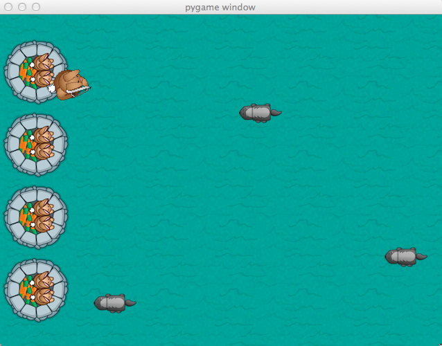
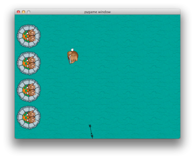
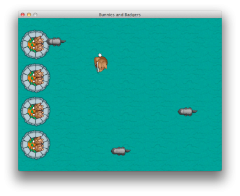
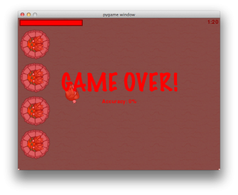

# BunnyPythonApp
A python based game using pygame library.

## Overview
Big Bunny, where the hero, the bunny, has to defend a castle against an attacking horde of badgers.

## How To Run

** Install Python **
Make sure you grab the 2.7.3 version and NOT the 3.3.0 version!
> Python 2.7.3 (v2.7.3:70274d53c1dd, Apr  9 2012, 20:52:43) 
[GCC 4.2.1 (Apple Inc. build 5666) (dot 3)] on darwin
Type "help", "copyright", "credits" or "license" for more information.
>>> 

** Verify PyGame **
To verify that you have PyGame installed properly, open IDLE or run Python via the Terminal and type in import pygame at the Python prompt. If this doesn’t result in any output, then you’re good.

If, on the other hand, it outputs an error like what’s shown below, then PyGame is not installed.
> Python 2.7.2 (default, Jun 20 2012, 16:23:33) 
[GCC 4.2.1 Compatible Apple Clang 4.0 (tags/Apple/clang-418.0.60)] on darwin
Type "help", "copyright", "credits" or "license" for more information.
>>> import pygame
Traceback (most recent call last):
  File "<stdin>", line 1, in <module>
ImportError: No module named pygame
>>> 

** Run a Game **

## Final Output - Screenshots

Screen 1                          |Screen 2
:--------------------------------:|:--------------------------------:
 |

Screen 3                          |Screen 4
:--------------------------------:|:--------------------------------:
 |
